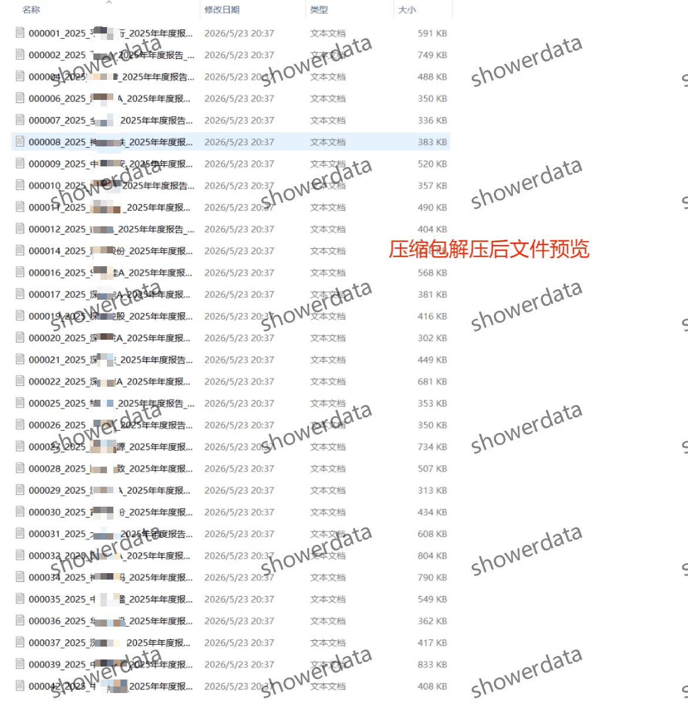
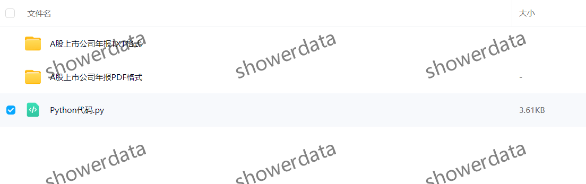
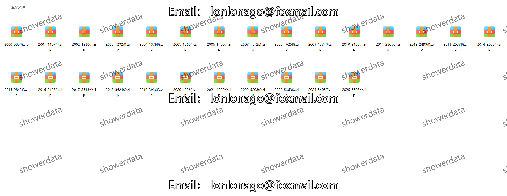

## Body

import os
import requests
from bs4 import BeautifulSoup

def download_annual_report(stock_code, year):
    url = f'https://www.example.com/annual_report/{stock_code}/{year}'
    response = requests.get(url)
    if response.status_code == 200:
        with open(f'{stock_code}_{year}.pdf', 'wb') as f:
            f.write(response.content)
        with open(f'{stock_code}_{year}.txt', 'w') as f:
            f.write(response.text)
        print(f'Successfully downloaded {stock_code}_{year} annual report.')
    else:
        print('Failed to download the annual report.')

if __name__ == '__main__':
    stock_code = input('Enter the stock code: ')
    year = int(input('Enter the year (e.g., 2025): '))
    download_annual_report(stock_code, year)

## Images

item_956771328445

Here is a pay link on Stripe ( https://buy.stripe.com/3cs8yP7sY87d0vu9AB ). Please contact me lonlonago@foxmail.com after funding $89, and I will send you a complete data files , thank you!

